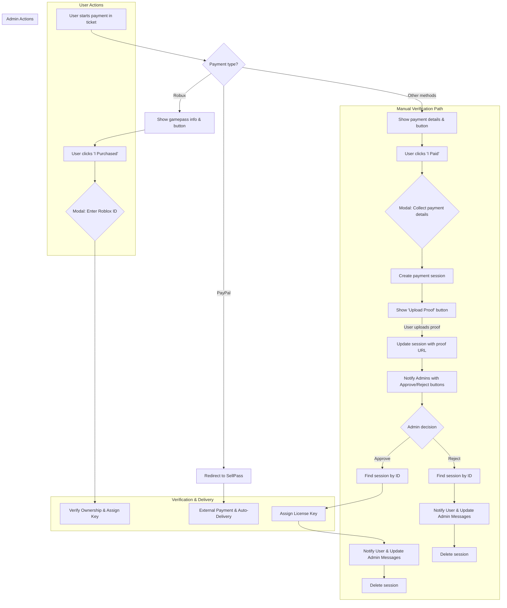
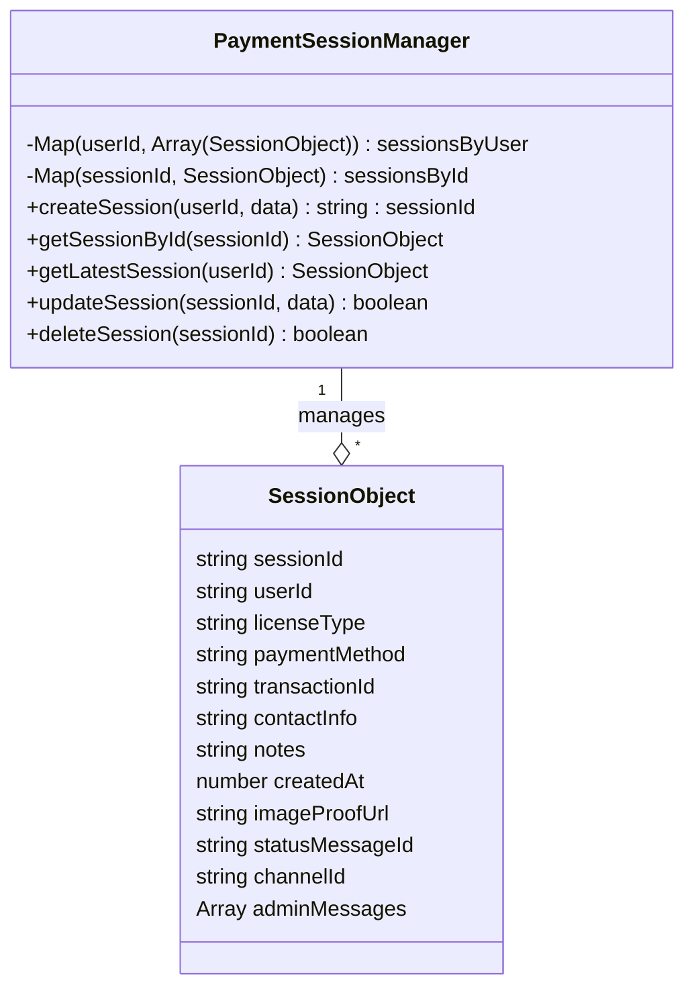
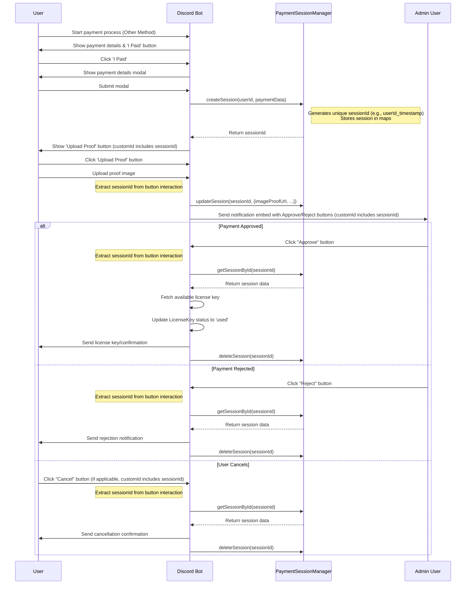

# AWPT Payment and License Services Overview

This document outlines the workflow and components of the Automated Weekly/Monthly Pass Ticket (AWPT) bot's payment processing and license management systems. These systems work together to handle user purchases, verify payments, assign license keys, and manage the license key inventory.

## Table of Contents

1. [Payment System](#payment-system)
   - [Payment Flow](#payment-flow-conceptual)
   - [Detailed Payment Steps](#detailed-steps--components)
   - [Payment Session Management](#payment-session-management-for-other-methods)
2. [License Management System](#license-management-system)
   - [Data Model](#data-model-srcdatabasemodelslicensekeyjs)
   - [Core Functionality](#core-functionality-srcutilspaymentlicenseutilsjs)
   - [Admin Interface](#admin-interface-srccommandsmanagerslicensejs)
   - [Support Key Request Flow](#support-key-request-flow)
3. [System Interaction](#system-interaction)
4. [Pricing & Configuration](#pricing--configuration)
5. [Monitoring & Notifications](#monitoring--notifications)
6. [Error Handling & Recovery](#error-handling--recovery)

## Payment System

The payment system handles the user-facing purchase process, guiding users through selecting a license type and payment method, verifying the payment, and ultimately delivering the license key upon successful completion.

### Payment Flow (Conceptual)

This flowchart illustrates the general paths a user might take through the payment system, focusing on the "Other Methods" flow which requires manual verification.



### Detailed Steps & Components

#### 1. Initiation

- Payment process begins in a ticket channel when a user interacts with a payment button
- The `createPaymentEmbed()` function in `paymentHandler.js` generates an embed with:
  - Available license types (Weekly/Monthly) with pricing information
  - Payment method options (Robux, PayPal, Other Methods)
  - Action buttons for each payment method

#### 2. Payment Method Handling

##### Robux Flow

- **`handleRobloxPayment(interaction, licenseType)`**
  - Displays the correct Roblox gamepass link for the selected license type
  - Shows an "I Purchased the Gamepass" button with a unique ID that includes the license type
  - Uses `PAYMENT_METHODS.ROBUX.urls[licenseType]` to provide the correct gamepass URL

- **`showRobloxVerificationModal(interaction, licenseType)`**
  - When user clicks "I Purchased", displays a modal to collect their Roblox User ID
  - Creates a unique modal ID to prevent collisions
  - Includes fallback logic for handling race conditions

- **`verifyAndProcessRobloxPurchase(interaction, licenseType)`**
  - Validates the submitted Roblox User ID using `validateRobloxUserId(userId)`
  - Blocks specific IDs such as owner group ID (`2425307148`) for security
  - Checks for existing licenses with `checkExistingLicense({ robloxUserId })`
  - Verifies gamepass ownership using `verifyGamepassOwnership(userId, gamepassId)`
  - If validation passes:
    - Gets an available license key via `getAvailableLicenseKey(licenseType)`
    - Updates license status to `used` and links both the Discord and Roblox IDs
    - Sends confirmation to the user and notification to admins
  - Handles edge cases like when users already own the gamepass via `showGamepassRemovalInstructions()`

##### PayPal Flow

- **`handlePaypalOption(interaction)`**
  - Shows options for Weekly or Monthly license selection
  - Uses buttons with custom IDs `paypal_weekly` and `paypal_monthly`

- **`handlePaypalPayment(interaction, licenseType)`**
  - Provides a direct link to the external SellPass page
  - Uses `PAYMENT_METHODS.PAYPAL.urls[licenseType]` to provide the correct SellPass URL
  - Stores payment info in `interaction.client.tempPaymentData` for cancellation support
  - Sends a detailed embed with instructions and a "Cancel" button
  - Payment verification and license delivery happen automatically through SellPass (external process)

##### Other Payment Methods (Manual Verification)

- **`handleOtherPayment(interaction, licenseType)`**
  - Displays alternative payment information from `PAYMENT_METHODS`:
    - International Payment (G2A, PIX, iDEAL, etc.)
    - CashApp tag (`$den7i`)
    - Apple Pay number (`6892412574`)
    - GCash number (`09356040108`)
  - Shows an "I Made A Payment" button with customID `confirm_payment_${licenseType}`

- **`handlePaymentConfirmation(interaction, licenseType)`**
  - Displays a modal with fields for:
    - Payment method used
    - Transaction ID (optional)
    - Contact information (email/phone)
    - Additional notes (optional)

- **`processPaymentConfirmation(interaction, licenseType)`**
  - Creates a unique payment session via `paymentSessions.createSession(userId, paymentData)`
  - Session contains all collected payment details plus unique `sessionId`
  - Shows a "Upload Payment Proof" button that includes the `sessionId` in its customID

- **`handleProofUpload(interaction)`**
  - Extracts `sessionId` from the button customID
  - Requests an image upload from the user via message collector
  - Updates the session with the uploaded image URL via `updateSession(sessionId, { imageProofUrl })`
  - Sends a notification to admins with "Approve" and "Reject" buttons that include the `sessionId`
  - Updates the user with a confirmation message

#### 3. Manual Approval/Rejection

- **`handlePaymentApproval(interaction)`**
  - Only available to users in `config.allowedUserIds`
  - Retrieves the payment session data using extracted `sessionId` from button customID
  - Gets an available license key via `getAvailableLicenseKey(licenseType)`
  - Updates the license status to `used` and links the Discord ID
  - Notifies the user with license key information
  - Updates all related messages in the ticket and admin channels
  - Cleans up the payment session via `deleteSession(sessionId)`

- **`handlePaymentRejection(interaction)`**
  - Only available to users in `config.allowedUserIds`
  - Retrieves the payment session data using `sessionId`
  - Notifies the user about the rejection
  - Updates all related messages in the ticket and admin channels
  - Cleans up the payment session via `deleteSession(sessionId)`

#### 4. Cancellation & Clean-up

- **`handlePaymentCancel(interaction, licenseType)`**
  - Can be triggered by either a user or administrator
  - Extracts `sessionId` from the button customID when available
  - Falls back to getting the latest session for older format buttons
  - Updates any related messages in the ticket with disabled buttons
  - Cleans up the payment session via `deleteSession(sessionId)`

#### 5. Stock Management

- **`checkAndUpdateLicenseAvailability(client, channel, userId)`**
  - Periodically checks available key counts in the database
  - Uses a caching system to prevent frequent database queries
  - Maintains state of current inventory levels with detailed stock status
  - When stock is critical, disables purchase buttons in embeds
  - Sends notifications to admins when stock levels are low
  - Updates `keyAvailabilityCache` with current stock levels and status flags

- **`updateAllPaymentEmbeds(client, weeklyCritical, monthlyCritical)`**
  - Updates all payment embeds across all open tickets when stock status changes
  - Finds all ticket channels in the ticket category
  - Filters for Purchase type tickets only
  - Updates embeds with current stock availability

- **`forceInitialPaymentEmbedsUpdate(client)`**
  - Runs once during bot startup to ensure all embeds are up to date
  - Immediately checks stock levels and updates all payment embeds
  - Sends initial admin notification if stock is low

### Payment Session Management (for "Other Methods")

The `PaymentSessionManager` class handles concurrent manual payment flows without data conflicts, ensuring each payment process is isolated and traceable.

**Class Structure:**



**Sequence Diagram:**



## License Management System

The License Management System is responsible for storing, managing, and retrieving license keys. It serves as the backend database for the payment system.

### Data Model (`src/database/models/licenseKey.js`)

The `LicenseKey` model uses a Mongoose schema with the following structure:

```javascript
const licenseKeySchema = new mongoose.Schema({
    key: {
        type: String,
        required: true,
        unique: true,
        validate: {
            validator: function(v) {
                return /^[A-Za-z0-9]{32}$/.test(v);
            },
            message: props => `${props.value} is not a valid license key format!`
        }
    },
    type: {
        type: String,
        enum: ['weekly', 'monthly'],
        required: true
    },
    status: {
        type: String,
        enum: ['available', 'used', 'requested'],
        default: 'available'
    },
    requestedBy: String,    // Store who requested the key
    requestedAt: Date,      // When the key was requested
    approvedBy: String,     // Who approved the request
    discordUserId: String,  // Discord user who redeemed the key
    robloxUserId: String,   // Roblox ID linked to the key
    usedAt: Date,           // When the key was marked as used
    createdAt: {
        type: Date,
        default: Date.now
    }
});
```

- **Key Statuses:**
  - `available`: Keys ready for assignment to users
  - `used`: Keys that have been assigned to a user
  - `requested`: Keys that have been requested by support staff

### Core Functionality (`src/utils/payment/licenseUtils.js`)

The license system provides the following primary functions:

#### Key Management Functions

- **`getAvailableLicenseKey(type)`**
  - Finds and returns an available license key of the specified type (weekly/monthly)
  - Returns null if no keys are available
  - Used by the payment system when a purchase is approved

- **`importLicenseKeys(keysText, licenseType)`**
  - Processes bulk license key imports from text
  - Validates each key format (32 character alphanumeric)
  - Checks for duplicates against existing keys
  - Returns detailed statistics about the import process
  - Used by admin `/license import` command

- **`reserveLicenseKey(keyId, discordUserId)`**
  - Marks a license key as `used` and links it to a Discord user ID
  - Sets the `usedAt` timestamp
  - Used for manual payment methods when admin approves

- **`activateLicenseKey(keyId, robloxUserId)`**
  - Adds the Roblox user ID to an already reserved license key
  - Validates the Roblox ID and checks for existing licenses
  - Used for Robux purchases after gamepass verification

#### Reporting Functions

- **`getLicenseStats()`**
  - Returns comprehensive statistics about key inventory
  - Counts keys by type (weekly/monthly) and status (available/used/requested)
  - Used by admin dashboard and monitoring system

- **`getLicenseTransactions(days = 30)`**
  - Retrieves recently used license keys within specified time period
  - Returns data used for charts and transaction analysis
  - Includes error handling for database connection issues

#### Support Staff Functions

- **`requestLicenseKeys(type, quantity, requesterId)`**
  - Allows support staff to request a batch of keys
  - Changes key status from `available` to `requested`
  - Records who requested the keys and when

- **`approveKeyRequest(keyIds, approverId)`**
  - Allows admins to approve requested keys
  - Records who approved the request
  - Keys remain in `requested` status but with approver information

### Admin Interface (`src/commands/Managers/license.js`)

The `/license` slash command provides comprehensive management capabilities for authorized users (defined in `config.allowedUserIds`).

#### Command Structure

The command has three primary subcommands, each with specific options:

```txt
/license [action] <options>
```

- **`action`** (required): `import`, `view`, or `search`
  - **import options:**
    - `import_type`: `weekly` or `monthly`
    - `file`: Attachment with license keys (one per line)
  - **view options:**
    - `view_type`: `Statistics`, `Transactions`, or `All Keys`
    - `export`: Boolean to export keys as CSV
  - **search options:**
    - `search_key`: Full or partial license key to search for

#### Key Features

- **Statistics Dashboard**
  - Displays counts for available, used, and requested keys by type
  - Interactive buttons for navigating to other views

- **Transaction Analysis**
  - Shows historical usage data with charts (bar or line)
  - Calculates trends, averages, and identifies most active periods
  - Generates visual charts using Canvas

- **Key Management**
  - Paginated view of all keys with filtering options
  - Search functionality for finding specific keys
  - Export capabilities for backup and record-keeping

- **Bulk Import**
  - Validates and imports keys from text files
  - Detects duplicates and invalid formats
  - Provides detailed result reports

#### UI Components

Each view includes multiple action rows with buttons for navigation and filtering:

- **Main Stats View:** Export, Search, View Transactions, View All Keys
- **All Keys View:** Pagination, Type Filters (All, Weekly, Monthly), Status Filters (Available, Used, Requested)
- **Transactions View:** Back to Stats, Refresh Data, Toggle Chart Type
- **Search Results:** Back to View, New Search

### Support Key Request Flow

A separate system allows support staff to request batches of license keys for special cases:

1. Support staff uses `/requestkeys` command with type and quantity
2. System uses `requestLicenseKeys()` to mark available keys as `requested`
3. Admins receive notification about the request
4. Admins can approve requests using `approveKeyRequest()`, which links their ID to the keys
5. Support staff can then distribute these keys as needed

## System Interaction

The Payment and License systems are tightly integrated, with clear responsibilities:

1. **License Consumption Flow:**
   - When a payment is verified (Robux, PayPal, manual approval)
   - Payment system calls `getAvailableLicenseKey(type)`
   - If successful, it updates key status via `reserveLicenseKey` or `activateLicenseKey`
   - License key is delivered to the user and linked to their Discord/Roblox IDs

2. **Inventory Monitoring:**
   - `checkAndUpdateLicenseAvailability()` periodically checks key counts
   - Uses `getLicenseStats()` to get current inventory levels
   - Updates UI elements based on stock status
   - Notifies admins when stock is low via `checkLicenseKeyInventory()`

3. **Data Analysis:**
   - `/license view transactions` uses `getLicenseTransactions()` to retrieve historical data
   - Generates charts and calculates metrics for admin review
   - Helps track usage patterns and plan inventory needs

4. **Key Request Workflow:**
   - Support staff request keys using `requestLicenseKeys()`
   - Admins approve requests with `approveKeyRequest()`
   - Keys are then distributed to users manually by support staff

## Pricing & Configuration

The system uses a centralized pricing and payment method configuration in `paymentHandler.js`:

### Pricing Structure

```javascript
const PRICES = {
    WEEKLY: {
        ROBUX: 2400,
        USD: '$6.99',
        PHP: 420
    },
    MONTHLY: {
        ROBUX: 8600,
        USD: '$24.99',
        PHP: 1300
    }
};
```

### Payment Methods

```javascript
const PAYMENT_METHODS = {
    ROBUX: {
        name: 'Robux',
        icon: '<:robux:1351602097786851419>',
        description: 'Pay with Roblox gamepass',
        urls: {
            weekly: 'https://www.roblox.com/game-pass/1022970504/Donation-Awp-Party',
            monthly: 'https://www.roblox.com/game-pass/1030833419/BIG-DONATION-AWP-MONTH'
        }
    },
    INTERNATIONAL: {
        name: 'International Payment',
        icon: '🌍',
        description: 'G2A, PIX, iDEAL, etc.',
        link: 'https://www.g2a.com/binance-gift-card-75-usdt-key-i10000337768028?uuid=2e561ccb-1154-4f85-8947-07262a6a4460'
    },
    CASHAPP: {
        name: 'CashApp',
        icon: '<:cashapp:1352975674201341972>',
        value: '$den7i'
    },
    PAYPAL: {
        name: 'PayPal',
        icon: '<:paypal:1352975175468978266>',
        description: 'Pay through our SellPass website',
        urls: {
            weekly: 'https://buyawp.sellpass.io/products/weekly',
            monthly: 'https://buyawp.sellpass.io/products/monthly'
        }
    },
    APPLEPAY: {
        name: 'Apple Pay',
        icon: '<:applepay:1352975430222876713>',
        value: '6892412574'
    },
    GCASH: {
        name: 'GCash',
        icon: '<:gcash:1352975416511430759>',
        value: '09356040108'
    }
};
```

### Roblox Gamepass Configuration

```javascript
const GAMEPASSES = {
    WEEKLY: '1022970504',  // The weekly gamepass ID
    MONTHLY: '1030833419'  // The monthly gamepass ID
};
```

## Monitoring & Notifications

The system includes robust monitoring and notification features:

1. **Stock Level Monitoring**
   - Periodic checks of available keys via `checkAndUpdateLicenseAvailability()`
   - Caching system to reduce database load while maintaining accurate data
   - Defined thresholds: `CRITICAL_THRESHOLD = 1` and `LOW_THRESHOLD = 10`

2. **Admin Notifications**
   - `sendNotificationToAdmins(client, embed, components)` sends alerts to all users in `config.allowedUserIds`
   - `checkLicenseKeyInventory(client)` creates alerts when stock is critically low
   - Notification includes detailed counts and status indicators for each license type

3. **UI Feedback**
   - Updates all payment embeds across tickets when stock status changes
   - Disables purchase buttons when stock is critically low
   - Clearly communicates stock status to users before purchase

## Error Handling & Recovery

The system implements comprehensive error handling to maintain stability:

1. **Safe Interaction Responses**
   - `safeInteractionResponse(interaction, options, isUpdate)` handles various interaction states
   - Provides fallback responses when interactions fail

2. **Transaction Verification Safety**
   - Rate limit detection and retry mechanisms in Roblox API calls
   - Validation of user inputs before database operations
   - Security measures to prevent abuse (blocked IDs list)

3. **Database Connection Handling**
   - Checks database connection state before operations
   - Provides fallback behaviors when database is unavailable
   - Maintains caching to reduce dependency on constant database access

4. **Session Management**
   - Isolated payment sessions to prevent data contamination
   - Cleanup procedures for abandoned sessions
   - Robust identification with unique session IDs

## Security & Validation

The AWPT payment system incorporates multiple security layers to protect against fraud and misuse:

### Roblox Verification Flow

1. **ID Validation**
   - Uses Roblox API to validate that the provided user ID exists
   - Enforces numeric format validation before API calls
   - Returns validation result with username if valid

   ```javascript
   async function validateRobloxUserId(userId) {
       try {
           if (!userId || isNaN(parseInt(userId))) {
               return { valid: false, username: null };
           }
           
           const response = await fetch(`https://users.roblox.com/v1/users/${userId}`);
           if (!response.ok) {
               return { valid: false, username: null };
           }
           
           const data = await response.json();
           return { valid: true, username: data.name };
       } catch (error) {
           console.error('[ERR]: Failed to validate Roblox user ID:', error);
           return { valid: false, username: null };
       }
   }
   ```

2. **Ownership Verification**
   - Verifies gamepass ownership through Roblox API
   - Implements blocklist of specific user IDs (like owner group)
   - Handles API rate limits and failures gracefully

   ```javascript
   async function verifyGamepassOwnership(userId, gamepassId) {
       try {
           // Block access to owner group ID - security measure
           const blockedIds = ['2425307148'];
           if (blockedIds.includes(userId)) {
               return false;
           }

           // API call to verify ownership
           const response = await fetch(`https://inventory.roblox.com/v1/users/${userId}/items/GamePass/${gamepassId}`);
           const data = await response.json();
           
           return data && Array.isArray(data.data) && data.data.length > 0;
       } catch (error) {
           console.error('[ERR]: Failed to verify gamepass ownership:', error);
           return false;
       }
   }
   ```

3. **Double-Purchase Prevention**
   - Checks if user already has an active license
   - Prevents users from purchasing multiple licenses for the same account
   - Provides guidance for gamepass removal if needed

   ```javascript
   async function checkExistingLicense(data) {
       try {
           const { discordUserId, robloxUserId } = data;
           const query = {};
           
           if (discordUserId) query.discordUserId = discordUserId;
           if (robloxUserId) query.robloxUserId = robloxUserId;
           
           if (Object.keys(query).length === 0) return false;
           
           const existingLicense = await LicenseKey.findOne({
               ...query,
               status: 'used'
           });
           
           return !!existingLicense;
       } catch (error) {
           console.error('[ERR]: Failed to check existing license:', error);
           return false;
       }
   }
   ```

### Manual Payment Verification

1. **Proof Requirements**
   - Requires transaction ID for traceability
   - Mandates image proof of payment
   - Multi-stage verification prevents premature approvals

2. **Transaction Data Validation**
   - Validates all form fields before processing
   - Ensures contact information is provided for follow-up
   - Stores complete transaction details for audit trail

3. **Admin-Only Approval**
   - Restricts approval/rejection to users in `config.allowedUserIds`
   - Implements role-based security check before approval actions
   - Logs all approval actions with admin ID

   ```javascript
   async function handlePaymentApproval(interaction) {
       try {
           // Security check - only allowed users can approve
           if (!config.allowedUserIds.includes(interaction.user.id)) {
               return safeInteractionResponse(interaction, {
                   content: '❌ You are not authorized to approve payments.',
                   ephemeral: true
               });
           }
           
           // Extract sessionId and process approval
           const sessionId = extractSessionId(interaction);
           // ... approval logic
       } catch (error) {
           console.error('[ERR]: Failed to handle payment approval:', error);
       }
   }
   ```

### Lockdown & Anti-Abuse Measures

1. **Rate Limiting**
   - Implements cooldown periods for payment attempts
   - Prevents spam through Discord's built-in rate limits
   - Tracks repeated failures and escalates restrictions

2. **System Lockdown**
   - `isButtonLocked(buttonId)` checks if specific functionality is disabled
   - `getLockdownState()` provides current system availability status
   - Admins can lock down specific features during maintenance or incidents

3. **Session Isolation**
   - Each payment flow has a unique session ID
   - Sessions are user-specific to prevent cross-contamination
   - Automatic session cleanup for abandoned processes

## Audit & Logging System

The AWPT payment system maintains comprehensive logs for security and troubleshooting:

### Transaction Logging

1. **Payment Events**
   - All payment attempts are logged with timestamp, user ID, and method
   - Successful payments are recorded with full transaction details
   - Failed attempts track the reason and point of failure

2. **Administrative Actions**
   - Logs all admin approvals and rejections
   - Records which admin performed each action
   - Maintains complete administrative audit trail

3. **Key Management Events**
   - Tracks key imports with timestamp and admin ID
   - Records key status changes (available → used → expired)
   - Maintains history of key requests and approvals

### Exportable Reports

1. **Transaction Reports**
   - `/license view transactions` generates visual and data reports
   - Export option provides CSV format for external analysis
   - Includes filterable date ranges for targeted reporting

2. **Key Inventory Reports**
   - `/license view` with export option creates inventory snapshots
   - Provides full key list with current statuses
   - Includes metadata such as assignment dates and user IDs

3. **Custom Filtering**
   - Support for advanced filtering by key status, type, and date ranges
   - Search functionality for finding specific transactions
   - Pagination controls for handling large datasets

## Deployment & Maintenance

### Installation Requirements

1. **Dependencies**
   - Requires Node.js 16.9.0 or higher
   - Uses Discord.js v14+ for Discord API interaction
   - Requires MongoDB for license key storage
   - Uses node-fetch for external API requests
   - Relies on @napi-rs/canvas for chart generation

2. **Configuration**
   - Requires valid `config.json` with:
     - Discord bot token and client ID
     - MongoDB connection string
     - Admin/support role IDs and user IDs
     - Category and channel IDs for ticket system

3. **MongoDB Setup**
   - Requires MongoDB 4.4+ with replica set for transactions
   - Uses Mongoose for schema validation and queries
   - Relies on indexes for performance optimization

### Monitoring & Maintenance

1. **Key Inventory Management**
   - Regular monitoring of key stock levels
   - Scheduled import of new keys before depletion
   - Database maintenance for expired/unused keys

2. **Error Monitoring**
   - Console logging of errors with detailed context
   - Optional webhook notifications for critical errors
   - Performance monitoring for slow database queries

3. **Database Maintenance**
   - Regular backups of license key collection
   - Index optimization for query performance
   - Periodic cleanup of expired sessions

## Feature Enhancements & Roadmap

### Planned Improvements

1. **Payment Method Expansion**
   - Integration with additional payment processors
   - Support for cryptocurrency payments
   - Regional payment method customization

2. **License Management Enhancements**
   - Automatic key expiration and renewal system
   - Tiered license levels with different privileges
   - Bulk operations for key management

3. **User Experience Improvements**
   - Streamlined payment flow with fewer steps
   - Enhanced visual feedback for transaction status
   - Improved mobile support for payment process

### Technical Debt & Optimization

1. **Code Refactoring**
   - Migration to TypeScript for improved type safety
   - Implementation of dependency injection for better testability
   - Modularization of payment handlers for easier maintenance

2. **Performance Optimization**
   - Improved caching strategy for license counts
   - Batch processing for bulk operations
   - Optimized database queries with projection and lean options

3. **Error Handling Enhancement**
   - More granular error categorization
   - Improved recovery strategies for specific errors
   - Enhanced logging with structured format for easy parsing
