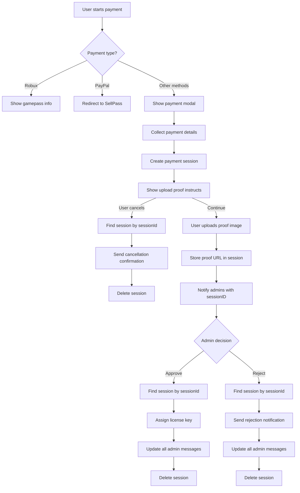
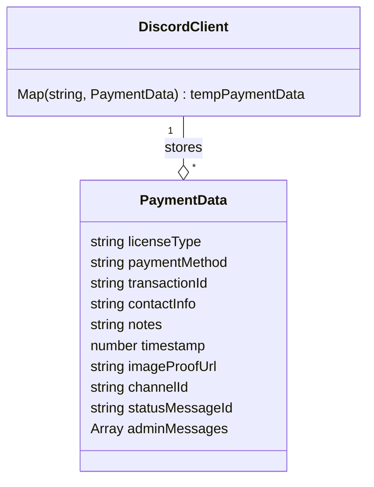
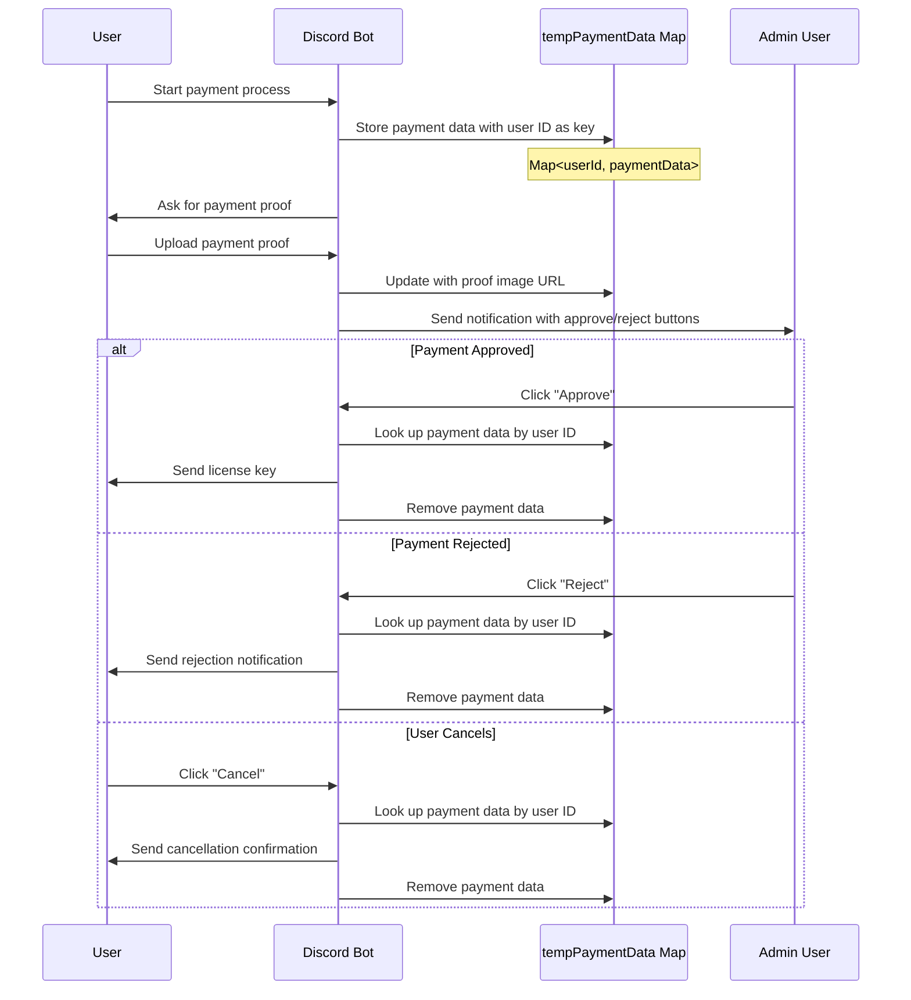
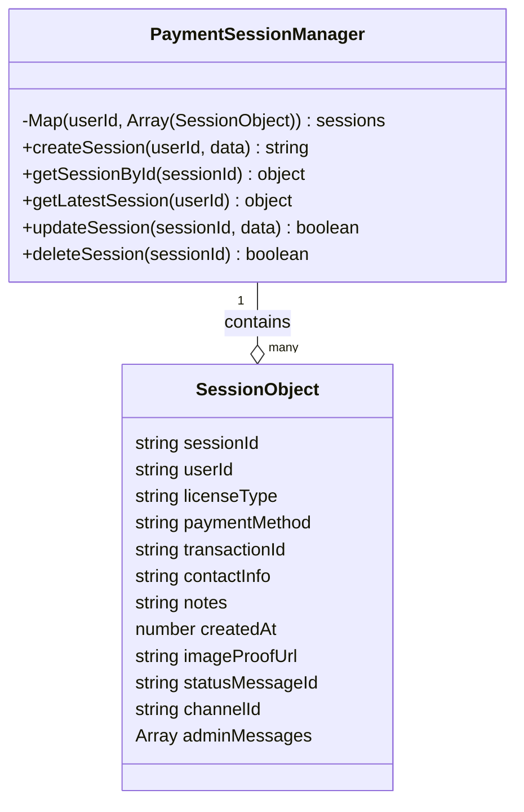
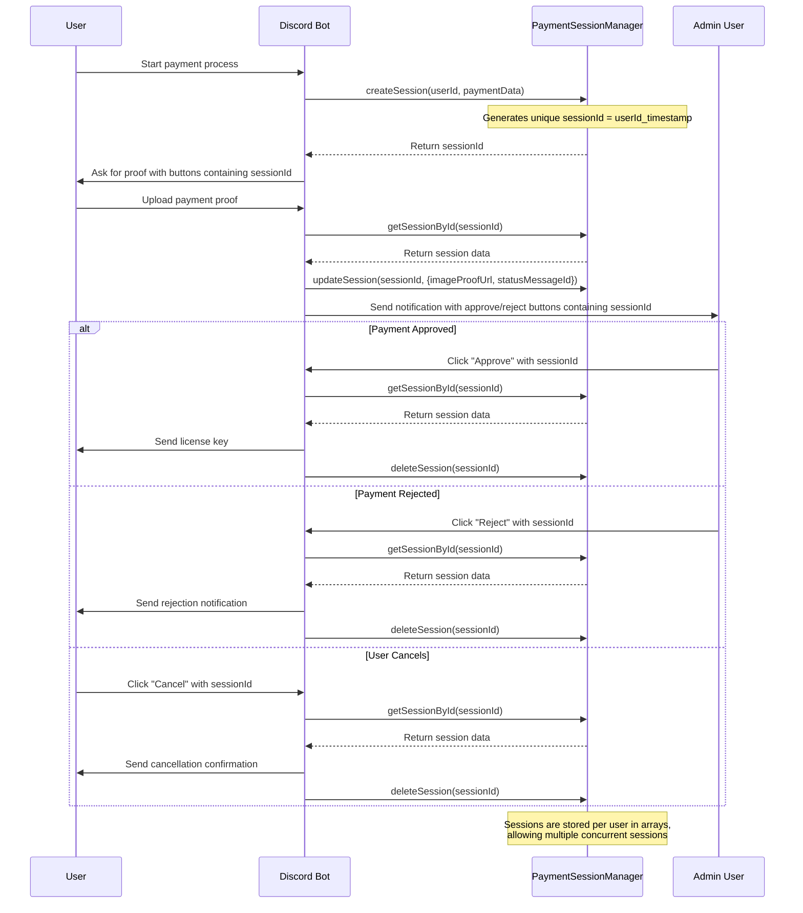

# Plans

Plans for making handling each unique payment session to prevent sample session interaction with each others and might cause security issues

## Ideas

## V1 - PaymentSession

### Class

### Structure

## V2 - PaymentSession

### Class

### Structure

